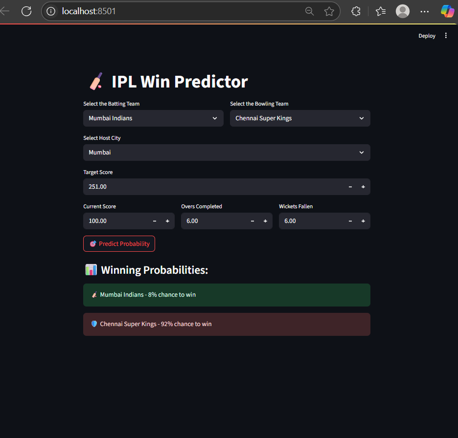

# 🏏 IPL Win Predictor

A machine learning web app built using **Streamlit** that predicts the winning probability of an IPL team based on match situation (target, score, overs, wickets, etc.).

---

## 🚀 Features

* Select batting and bowling teams from official IPL franchises.
* Choose the match city and input target score.
* Real-time inputs for current score, overs completed, and wickets fallen.
* Get instant probability of win/loss for the batting team.
* Built using **Streamlit**, **Scikit-learn**, and **Pickle** pipeline.

---

## 📁 Project Structure

```
IPL_Winner_Predictor/
├── app.py                # Streamlit app script
├── pipe.pkl              # Trained ML model pipeline (Pickle file)
├── notebooks/
│   └── model_training.ipynb  # Jupyter notebook used for training
├── requirements.txt      # Python dependencies
├── assets/
│   └── demo.png          # App screenshot
└── README.md             # You're here!
```

---

## 🧠 Model Training

* The model uses features like:

  * `batting_team`, `bowling_team`, `city`
  * `runs_left`, `balls_left`, `wickets_left`
  * `current run rate (CRR)`, `required run rate (RRR)`
* Encoded categorical features with `OneHotEncoder`.
* Trained using `LogisticRegression` for probability prediction.
* Serialized using `pickle` to `pipe.pkl`.

---

## 🛠️ Local Setup Instructions

### 1. Clone the repository

```bash
git clone https://github.com/sheikhmursalin/ipl-win-predictor
cd IPL_Winner_Predictor
```

### 2. Create a virtual environment (optional but recommended)

```bash
python -m venv venv
venv\Scripts\activate    # On Windows
```

### 3. Install dependencies

```bash
pip install -r requirements.txt
```

### 4. Run the Streamlit app

```bash
streamlit run app.py
```

Then open [http://localhost:8501](http://localhost:8501) in your browser.

---

## 💪 Run via Docker (Recommended)

### 1. Pull Docker Image

```bash
docker pull sheikhmursalin/ipl-win-predictor
```

### 2. Run the App

```bash
docker run -p 8501:8501 sheikhmursalin/ipl-win-predictor
```

Now visit 👉 [http://localhost:8501](http://localhost:8501) to access the app.

> ⚠️ Ensure Docker is installed and running on your machine.

### Optional: Build Docker Image Locally

```bash
docker build -t ipl-win-predictor .
docker run -p 8501:8501 ipl-win-predictor
```

### Sample Dockerfile

```dockerfile
FROM python:3.11-slim
WORKDIR /app
COPY . /app
RUN pip install -r requirements.txt
EXPOSE 8501
CMD ["streamlit", "run", "app.py", "--server.port=8501", "--server.address=0.0.0.0"]
```

---

## 💻 Live Demo on Render

Visit the live app at: [https://ipl-win-predictor-pl46.onrender.com](https://ipl-win-predictor-pl46.onrender.com)

---

## 📤 Deploy on Render (Free Hosting)

### Step-by-step:

1. Push your code to a public GitHub repository.
2. Go to [https://render.com](https://render.com) and sign in.
3. Click on **New Web Service**.
4. Connect your GitHub repo.
5. Set build & run commands:

* **Build Command:**

  ```bash
  pip install -r requirements.txt
  ```
* **Start Command:**

  ```bash
  streamlit run app.py --server.port=10000 --server.address=0.0.0.0
  ```
* **Runtime:** Python 3

6. Click Deploy. Done! 🚀

---

## 💻 Demo



---

## 📨 Connect with Me

* 🧑‍💻 **Sheikh Mursalin**
* 🔗 [LinkedIn](https://www.linkedin.com/in/sheikh-mursalin-bb4bb9227/)
* 👁️ [Twitter](https://x.com/Sheikh_Mursu)
* 📧 [er.sheikh.mursalin@gmail.com](mailto:er.sheikh.mursalin@gmail.com)

---

## 📌 Future Improvements

* Add more features like Duckworth-Lewis adjustments.
* Improve model with advanced algorithms (Random Forest, XGBoost).
* Add match history visualization.
* Deploy on platforms like Streamlit Cloud or Hugging Face Spaces.

---

## 📍 License

This project is open source and available under the [MIT License](LICENSE).

---

### ⭐️ Give it a star if you like this project!
